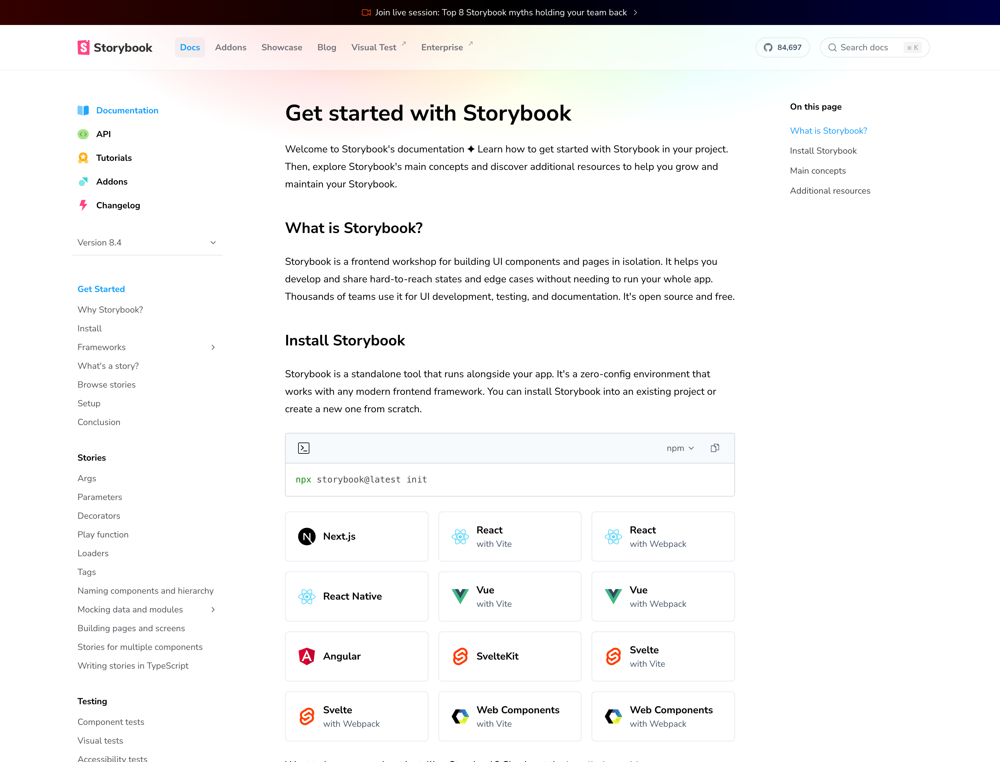
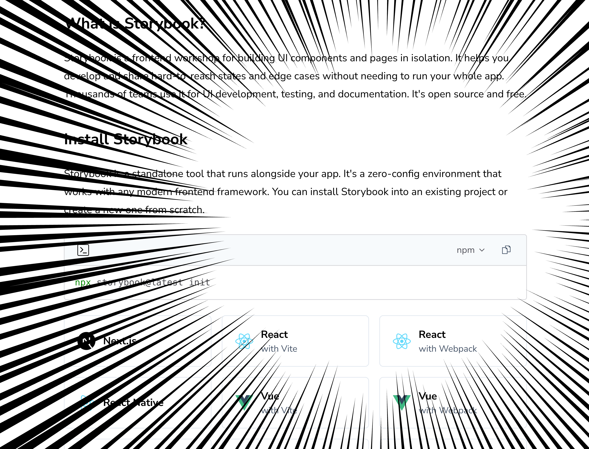
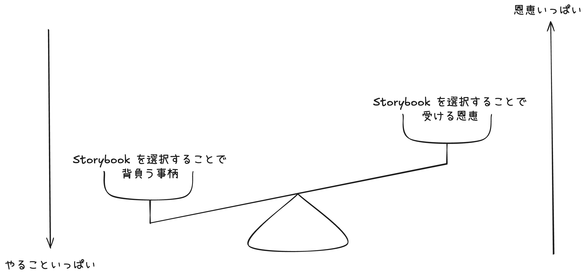
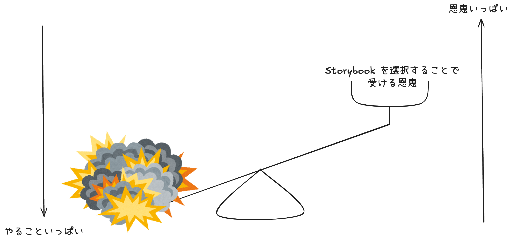

# Storybook との上手な向き合い方を考える

## りんたろー / re-taro

---


# 自己紹介

## りんたろー

- 三重県の高専で半導体学びながら学生しています
- 今はフリーランス、来春から緑色の会社で働きます
- Twitter: [@re_taro\_](https://twitter.com/re_taro_)
- GitHub: [re-taro](https://github.com/re-taro)
- すきなこと
  - 開発者体験に思いを馳せること

---

## 話すこと

#### 僕の考える Storybook と上手に向き合う方法

## ~~話さないこと~~ 話せないこと

#### その具体的な方法

---

# 突然ですが

<style scoped>
  section h1 {
    text-align: center;
  }
</style>

---

# zero-config 好きですか？

<style scoped>
  section h1 {
    text-align: center;
  }
</style>

---

# zero-config の嬉しさ

- PoC を作る時
- 社内ツールをリポジトリ区切ってシュッと作る時

などなど...

<style scoped>
  section p {
    text-align: right;
  }
</style>

---

# なぜ zero-config の話をしたのか

<style scoped>
  section h1 {
    text-align: center;
  }
</style>

---



---



<style scoped>
  section p {
    display: flex;
    justify-content: center;
  }
</style>

---

# 今日はそんな Storybook のお話をします

<style scoped>
  section h1 {
    text-align: center;
  }
</style>

---

# Storybook という選択

- レビュアーとの疎通を取るため
- view の実装に集中するため
- ブラウザ上で実行されるユニットテストを効率的に書くため

などなど...

<style scoped>
  section p {
    text-align: right;
  }
</style>

---

# Storybook という選択の光

```sh
pnpm dlx storybook@latest init
```

だけでセットアップが終わる！（諸説あり）

<style scoped>
  section p {
    text-align: right;
  }
</style>

---

# Storybook という選択の闇

```sh
pnpm dlx storybook@latest init
```

~~だけでセットアップが終わる！~~

## プロジェクトの構成に合わせた設定が必要

- 秘伝のタレとなった `babel.config.js` やそれを使う `webpackFinal`
- プロジェクト固有の対応で肥大化した `.storybook/preview.tsx`
- msw や DI コンテナを使ったモックの設定

<style scoped>
  marp-pre + p {
    text-align: right;
  }
</style>

---



---



---

## その結果...

- ロストテクノロジー化した、なんか知らんけど動いている Storybook
- 新しく Story が追加されることなく文鎮となった Storybook
- バンドラなどを刷新する際に足枷となるレガシーな Storybook

---

# Storybook と上手に向き合う == 天秤を釣り合わせる

ってこと

<style scoped>
  section p {
    text-align: right;
  }
</style>

---

## 天秤を釣り合わせるためには

- Storybook を使う目的を明確にする
- 目的から逆算して、受ける恩恵を取捨選択する

---

# Storybook を使う目的を明確にする

- レビュー支援
  - コンポーネント単位での挙動確認
  - Story の網羅性をレビュアーが確認 == 仕様の網羅性
  - デザイナーのレビュープロセスに組み込む
- テストに使用する
  - VRT
  - Portable stories を使った Play function の assertion

---

# 受ける恩恵

- レビュアーとの疎通を取ることができる
- 実装する際のプレイグラウンド
- カバレッジの計測
- インタラクションのテスト
- VRT

---

# 受ける恩恵の取捨選択

- レビュアーとの疎通を取ることができる
- 実装する際のプレイグラウンド
- カバレッジの計測
- インタラクションのテスト
- VRT

<style scoped>
  li:nth-child(n+3) {
    opacity: 0.4;
  }
</style>

---

# 「 Storybook とテスト」に対する僕の考え

## --> 時期尚早かなぁ...

---

# 時期尚早と感じる理由

## Storybook runtime 上でテストする方法に統合されている感覚

- Storybook v6 とかの頃: `composeStory` で `play function` の中身を `jest` with `testing-library` でアサーション！
- Storybook v7 とかの頃: インタラクション、a11y、カバレッジ計測を `test-runner` を使って行う！
- Storybook v8 とかの頃: `@storybook/test` が進歩してきたのでアサーションからカバレッジ計測までを `test-runner` で行う！

--> だんだん Storybook を起動してあることを前提としたテストの形式になってきている

---

# 現在の Storybook とテストの付き合い方

## Storybook とテストの分離

- Story の肥大化の回避
- テストにかかる時間の短縮

## Storybook を利用したテストの例

- `composeStory` で `play function` の中身を `jest` with `testing-library` でアサーション
  - setup file に Storybook の依存が発生するがそこまでコストがかからない
- Storybook 自体の腐敗防止のためのテスト
  - 各 Story が正常に描画されているか

---

## :warning: 注意！:warning:

ここまで話してきたことは、気楽な Storybook との付き合い方。

--> スタートダッシュの時にエイヤでいれた Storybook を腐らせないための方法

プロダクトが成熟したりチームの規模が大きくなった、もしくは基盤改善が好きな人材が増えた場合などは、少しずつ天秤にかける重み（得る恩恵）を変えていくことが大事。

---

# まとめ

- Storybook は便利だが、使い方を間違えると足枷になる
- Storybook を使う目的を明確にし、受ける恩恵を取捨選択する
  - Storybook とテストは分離して考えることが大事 (現時点では)
- 徐々に Storybook との付き合い方を見直していくことが大事
